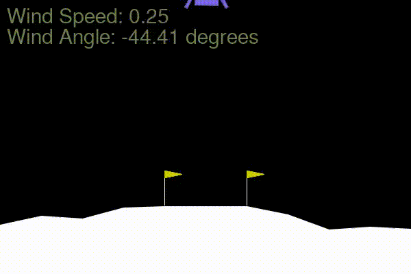

# RL-Experiments

Experimenting with different RL algorithms on a custom Lunar Lander environment using DI-Engine.

## Sample Results

## Lunar Lander

Modified `LunarLander-v3` environment to have different wind speeds and directions. The wind varies gradually during the episode, and is displayed in the top left corner of the screen.

### Installation

`pip install -r requiruments.txt`